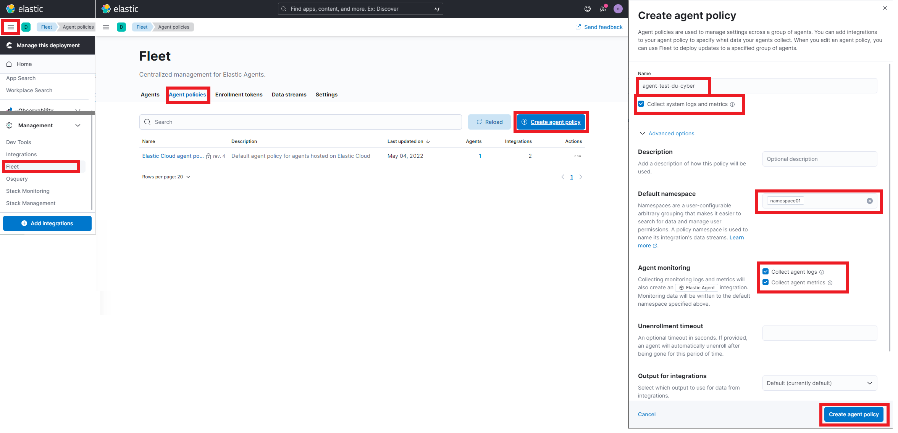
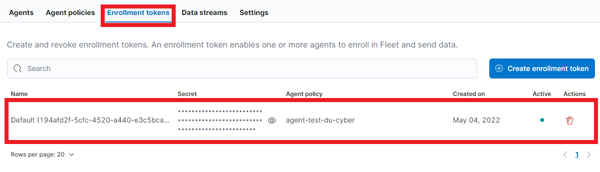
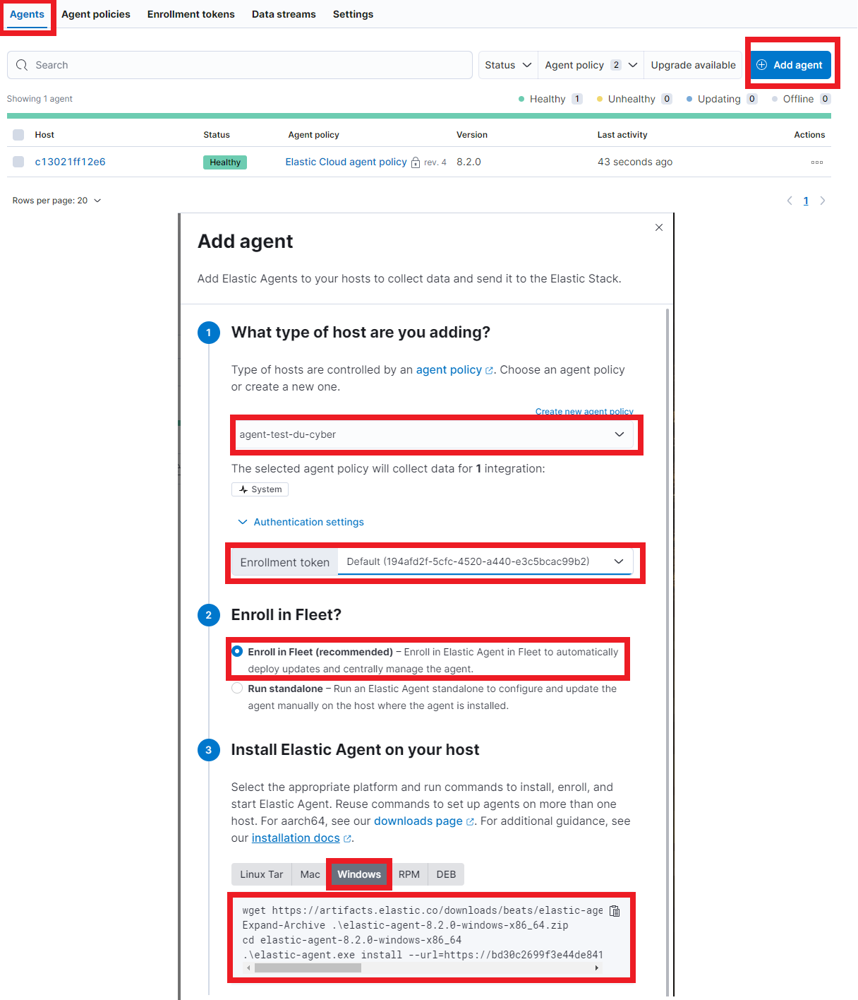
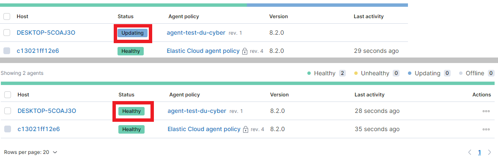
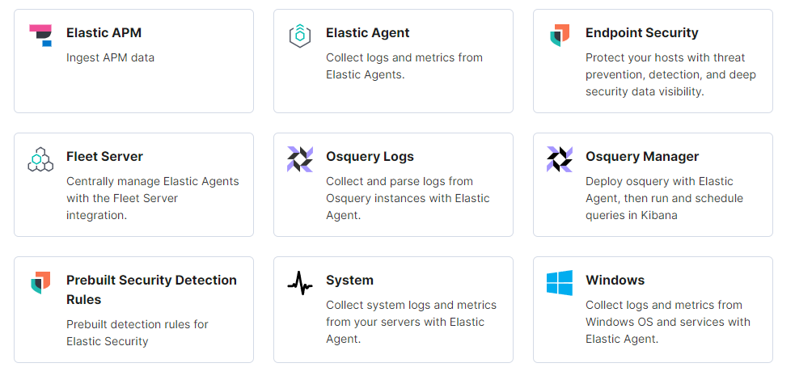

# Organiser la récolte de données
# Sommaire

- [Organiser la récolte de données](#organiser-la-récolte-de-données)
- [Sommaire](#sommaire)
- [Documentation additionelle](#documentation-additionelle)
  - [Configuration et installation de l'agent elastic](#configuration-et-installation-de-lagent-elastic)
    - [Préparer le serveur](#préparer-le-serveur)
    - [Installer l'agent](#installer-lagent)
    - [standalone elastic agent](#standalone-elastic-agent)
    - [Ajouter des intégrations](#ajouter-des-intégrations)
  - [Intégrations utilisées pour le projet](#intégrations-utilisées-pour-le-projet)

- Elastic Agent et Fleet facilitent l’intégration de vos systèmes à Elastic : https://www.elastic.co/fr/blog/elastic-agent-and-fleet-make-it-easier-to-integrate-your-systems-with-elastic

- Vérifier la santé de l'agent elastic : https://www.elastic.co/guide/en/fleet/master/view-elastic-agent-status.html
- installer elastic agent, debug :  https://discuss.elastic.co/t/elastic-agent-showing-unhealthy-with-windows-system/265341
- redémarrer elastic agent : https://www.elastic.co/guide/en/fleet/current/start-stop-elastic-agent.html
- Problématique d'enrôlement de l'agent : https://discuss.elastic.co/t/elastic-agent-wont-enroll/282212

# Documentation additionelle

## Configuration et installation de l'agent elastic
> Ce guide est réservé aux versions déssai et aux versions payantes d'ELK. les procédures sont très différentes quand on utilise une version gratuite. </br>
> Ce document couvres uniquement installaiton et la configuration basique de l'agent, basiquement configuré. </br>

> Si la VM utilisée est prévue pour faire détonner des virus, et que l'on souhaite une configuration de windows spéciale, on peut utiliser les scripts du répertoire GITHUB ci-contre pour préconfigurer la VM : https://github.com/mandiant/flare-vm/tree/master/flarevm.win10.preconfig.fireeye/tools

### Préparer le serveur

Sur le serveur ELK dans le cloud, la partie Fleet arrives entièrement configuré. 
Pas de service à activer, ni de préconfiguration à faire :

Dans le menu déroulant à gauche, rendez vous dans `Management > Fleet` cette partie permet de visualiser les agents connectés. 
Dans l'onglet horizontal, séléctionnez `agent policies` et créez une nouvelle police pour les agents (pensez à créer un namespace pour attribuer les ressources à ce namespace :



Un tocken d'enrollement est automatiquement configuré :



Créez un agent pour le déployer sur la VM de test :



### Installer l'agent 

On peut installer l'agent sur l'hôte (vm de test) de deux manières : soit par le script complet proposé, soit en téléchargeant l'exécutable avant (plus rapide) (voir le lien "download page" dans la capture ci dessus), le dézippant, et exécutant l'agent avec la dernière commande de cette section :

Voici l'exemple complet en powershell :
```powershell
wget https://artifacts.elastic.co/downloads/beats/elastic-agent/elastic-agent-8.2.0-windows-x86_64.zip -OutFile elastic-agent-8.2.0-windows-x86_64.zip
Expand-Archive .\elastic-agent-8.2.0-windows-x86_64.zip
cd elastic-agent-8.2.0-windows-x86_64
.\elastic-agent.exe install --url=https://bd30c2699f3e44de8416540b151a71d8.fleet.us-central1.gcp.cloud.es.io:443 --enrollment-token=SEw5Tmo0QUJuUDBfMGpwMzMtb086M2htUWM4SHlTSmloeThpMTM5bS1pQQ==
```
J'ajoute ici la commande pour désinstaller l'agent, et quelques autres commandes pour débugger l'installation :

- Ajout possible de la commande `-v` pour "verbose" lors de l'exécution de l'installateur elastic-agent.exe
- Emplacement des fichiers de logs pour l'installation : `C:\Users\username\Documents\elastic-agent-8.1.2-windows-x86_64 (1)\elastic-agent-8.1.2-windows-x86_64`
- Une fois installé l'agent pose ses fichiers de logs dans le répertoire d'installation de l'agent : `C:\Program Files\Elastic\Agent\data\elastic-agent-6118f2\logs`
- Démarrer l'agent : `Start-Service Elastic Agent` / Arrêter l'agent : `Stop-Service Elastic Agent`
- Désinstaller l'agent elastic : exécuter en administrateur cette commande cmd : `C:\"Program Files"\Elastic\Agent\elastic-agent.exe uninstall`


Pour être sûr que cette première configuration fonctionne, on vérifieras la présence de ce nouvel agent via l'interface Kibana/FLEET sur le serveur Elastic. On attendras que son statut soit vert, si besoin, débugger lavec la doc elasticsearch, et les commandes/infos ci-dessus :
- Il semble aussi que la VM ai besoin d'un redémarrage pour que l'agent retourne un statut `Healthy`



### standalone elastic agent
> elastic agent peut être installé en mode standalone sans serveur. c'est ce que nous allons faire pour ce tuto. pas de mode automatique car nous sommes en mode gestion de projet, et pas en mode production.
> 
6) Modifiez votre configuration : localisation des fichiers de configuration : `/etc/elasticsearch` : penser à redémarrer le service si la config change.

https://www.elastic.co/fr/blog/how-to-setup-tls-for-elasticsearch-kibana-logstash-filebeat-with-offline-install-in-linux

### Ajouter des intégrations

Des intégrations préfabriquées pour elasticsearch peuvent être insérés dans l'agent, l'agent elastic vérifie régulièrement les changements sur sa propre configuration sur le serveur ELK. Pour ajouter une intégration :

Retourner dans l'interface de gestion des agents Fleet, et choissez la police de configuration de l'agent que vous souhaitez modifier. Cliquez sur "add integration" et recherchez les intégrations voulues. Attention, chaque intégration est différente. Sertaines intégration requierent une lisence elastic valide, ou de souscrire à une API. lisez bien la documentation de cette extention.

## Intégrations utilisées pour le projet



Comment ajouter une intégration ? 
- https://www.youtube.com/watch?v=pnGXjljuEnY

Lien vers une description de ces solutions :
https://www.elastic.co/fr/integrations/data-integrations

Documentation diverses sur ces intégrations
- Elastic APM : https://www.elastic.co/guide/en/apm/get-started/7.15/index.html
- Fleet and Elastic Agent : https://www.elastic.co/guide/en/fleet/master/index.html
- Elastic Security Solution && prebuild detection rules : https://www.elastic.co/guide/en/security/master/index.html
- OsQuery in Kibana Guide : https://www.elastic.co/guide/en/kibana/master/osquery.html

Gits officiels de ces intégrations ? :


On peut aussi ajouter des intégrations en fonction de ce que l'on veut faire : 
- Un programme de capture de paquet npcap peut être utilisé sur un agent elastic, pour remonter les informations des protocoles connus. 
- Des intégrations diverses pour des services bien spécifiques https://www.elastic.co/fr/integrations/ - https://www.elastic.co/fr/integrations/data-integrations
- On peut aussi construire ses propres intégrations : https://www.elastic.co/guide/en/integrations-developer/current/build-a-new-integration.html

Penser a redémarrer la machine hôte lorsque certaines intégrations sont installés (par exemple elastic security)

